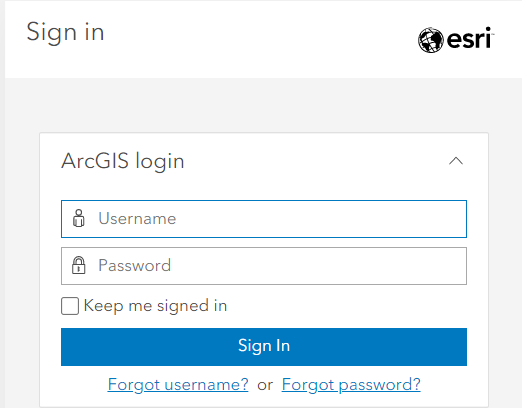

# Account Setup

*1*{: .circle .circle-purple} Navigate to [www.arcgis.com](https://www.arcgis.com/home/index.html) and click **Sign In**.

*2*{: .circle .circle-purple} Click **Create an account** at the very bottom. 

*3*{: .circle .circle-purple} Fill in your information.

*4*{: .circle .circle-purple} Sign in.

{: .note}
If you are interested getting a personal ArcGIS account, you can find more information [here](https://gis.ubc.ca/software/). Be mindful that students and departments have different options for licenses. Please contact Geospatial Systems Analyst Haitao Li (ht.li@ubc.ca) if you need help with UBC’s Esri product.

 

## ArcGIS Free vs. Enterprise Account
An ArcGIS free account can be created by anyone and is intended for noncommercial, nongovernmental use. When using ArcGIS StoryMaps with a public account, some advanced storytelling and customization features are not available, including:

- embedding web pages
- customizing story theme and logo
- Google analytics tracking ID
- including Audio
- image galleries
- timelines

You can still include images and video, embed map tours, and use the swipe tool. You can read more about features on the [ArcGIS Storymap Licensing page](https://doc.arcgis.com/en/arcgis-storymaps/reference/licensing.htm).

A free account on ArcGIS online does not allow you to do any spatial analysis on your web map like you could on a desktop GIS, however, it does allow styling, filtering, etc. By the end of this workshop you will have a better idea as to whether the free account meets your needs or not. 