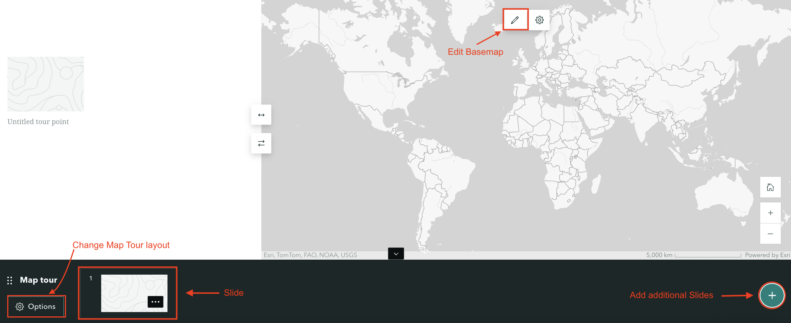
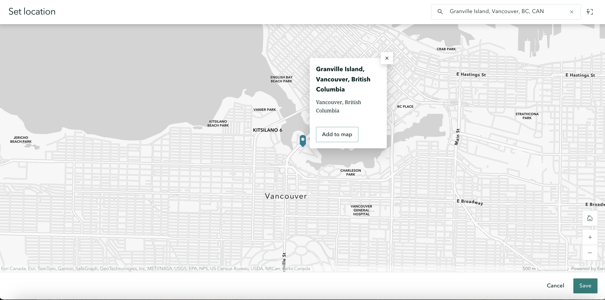

# Add Immersive Content: Map Tours and Sidecars

## Map Tours
You can create a map tour to showcase a set of places. You can decide whether your readers get to explore these places in any order, or are led through in an order of your choosing. 

If you select **start from scratch**, you'll be prompted to "Select a map tour layout". The options are Guided or Explorer. Guided leads the reader through an order of your choosing, whereas Explorer allows the reader to peruse on their own. 

When you choose a layout, a new content block will be added to your StoryMap. It will look something like the below. The bottom banner contains the "Slides" of your map. Each slide displays some text and/or multimedia, and is connected to a location on the map. 

 

- To add a location, click on the first Slide and select "Add location". Now, you can either search the location on the top-right, or zoom-in to it. With your cursor as a crosshair, click the location and save. Once you choose a point and click "Add to map", there are two options of zoom level that you can select when you add a location. Using map tour setting will automatically adjust the zoom level so all points are visible simultaneously. Use current zoom level will keep the zoom level always be street or city. You can always go back and edit locations later. 

- To customize the basemap, click the pencil icon. 

- You can also always change a map tour layout by going to its Options in the bottom left corner of the content block. 

 

To Do
{: .label .label-purple}
To practice, choose a layout and add some pictures to locations. 

 

## Sidecar
Scroll down on your StoryMap to add another content block. This time add a Sidecar from Immersive Content. In a Sidecar element, text and multimedia scroll over an image. In each slide of a Sidecar, you can add the same content blocks you would to your StoryMap. 