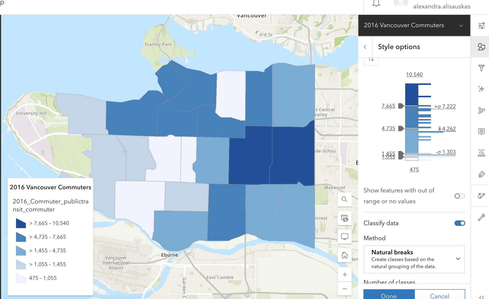
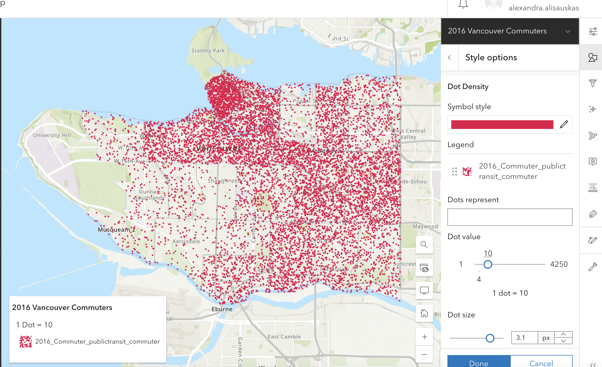
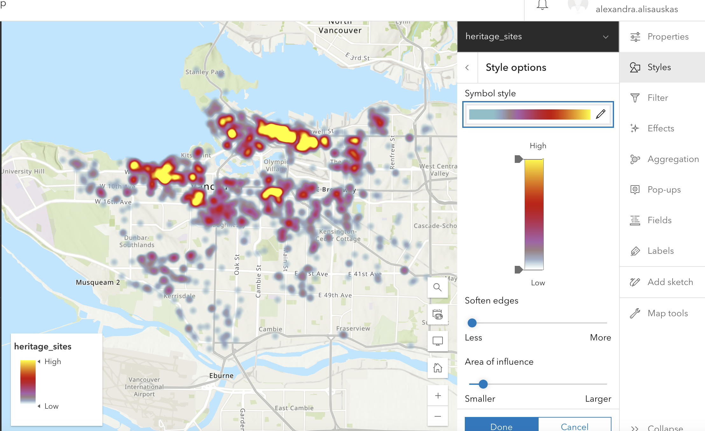
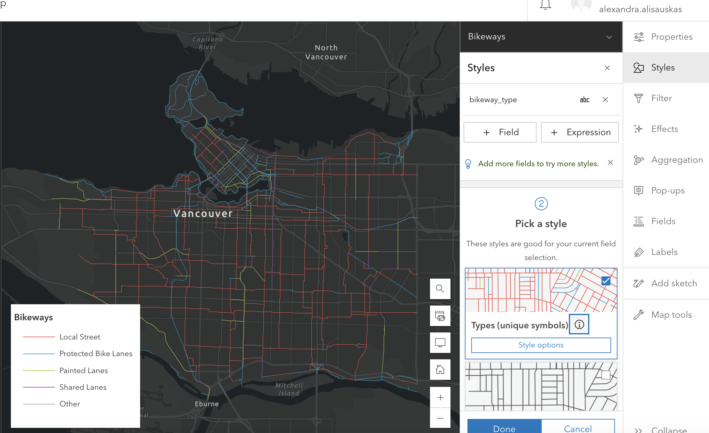
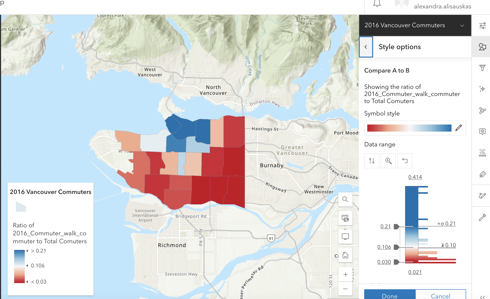

# Styling Layers
The Style tools available to you will depend on the features in your layer, and the fields you select to map. The default style is Location (single symbol), which shows the geographic boundaries, lines, or points of your data.

There are many different map types you can create easily on ArcGIS online, so play around with adding fields and seeing the options. We will go through a few map types and how to create them.

Read more about [ArcGIS Online’s Smart Mapping Styles](https://doc.arcgis.com/en/arcgis-online/create-maps/apply-styles-mv.htm).

We will only be looking at Smart Mapping styles. You can also use Arcade, ArcGIS’s expression language, to style and label your map, create informative pop-ups, and perform field calculations on your data. See [Get Started with ArcGIS Arcade](https://learn.arcgis.com/en/projects/get-started-with-arcgis-arcade/) to learn more.
{: .note}

 

## Counts and Amounts (color) aka Choropleth
Counts and Amounts (ArcGIS’ term for a choropleth) uses colors to represent your numeric or ranked data across geographical areas. The data represented needs to be linked to an enumeration area and standardized as a rate or ratio. In ArcGIS Online, you can decide whether to classify your data, and your data classification method. Read more about [Data Classification Methods](https://pro.arcgis.com/en/pro-app/latest/help/mapping/layer-properties/data-classification-methods.htm) and how you might want to use them.

The map below shows the number of public transit commuters by neighbourhood.

 

## Dot Density Map
Dot Density visualizes the distribution of one attribute or compare multiple attributes, however it does so randomly within a bounded geographic area. You can choose the quantity that each dot represents. Example: 1 dot represents 1,000 people or 1 dot represents 20 trees.

The map below is a dot density map for public transit commuters in Vancouver.

 

## Heat Map
A heat map shows areas of high activity with stronger colors that appear to glow hotter. It requires point features.

 

## Types (Unique Symbol)

Types (Unique Symbol) shows different categories of features — such as type of tree, road class, or province name — with different colors. Some categories will not have an inherent order. For categories that do, such as educational attainment and income, consider using a sequential color ramp to visualize ranked categories.

The map below shows bike paths by type. Note how the basemap has been changed to ensure these elements stand out.

 

## Compare A to B
If you want to compare data from two fields, you can use Compare A to B. The first attribute is compared to the second attribute, and represented as a simple ratio, or as “A as a percent of B.” Examples: Revenue / Cost of Sale, or Corn Acres / Total Acres, or Corn Acres / (Corn + Wheat Acres).

The map below represents Walker commuters as a percent of total walkers.

 

There are other comparison maps you can create as well. Play around with adding multiple data fields and seeing what comes up. Click on the i to learn more about each and how to use it.

----
#### More resources
For more in-depth instructions and examples, visit our workshop [Visualizing Data in ArcGIS Online](https://ubc-library-rc.github.io/intro-AGOL/).
