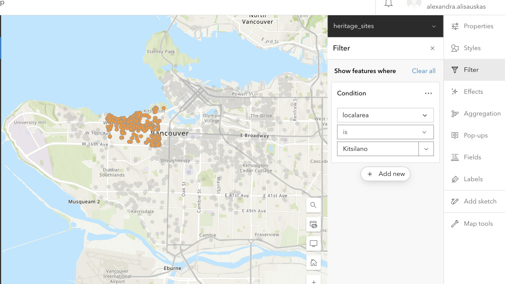
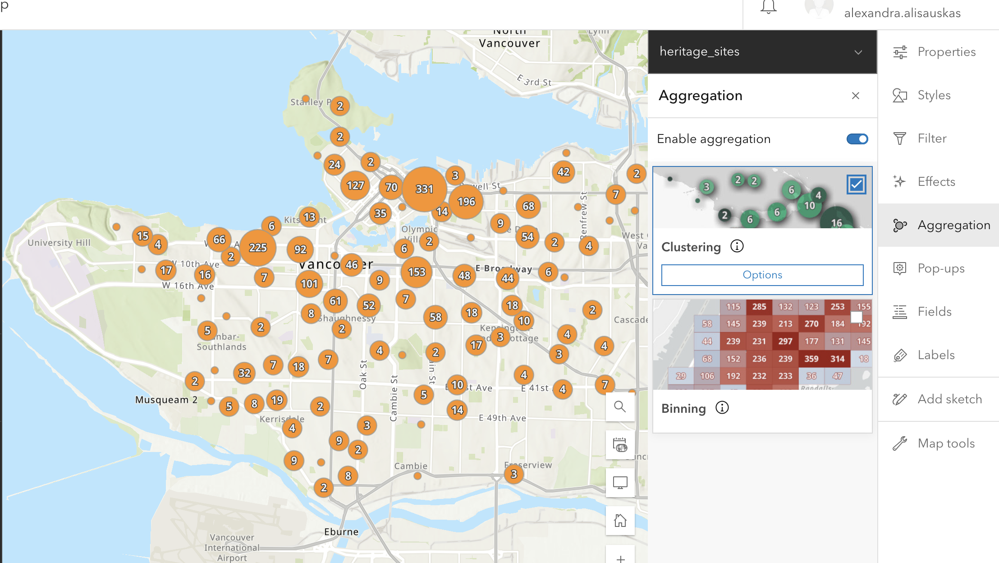
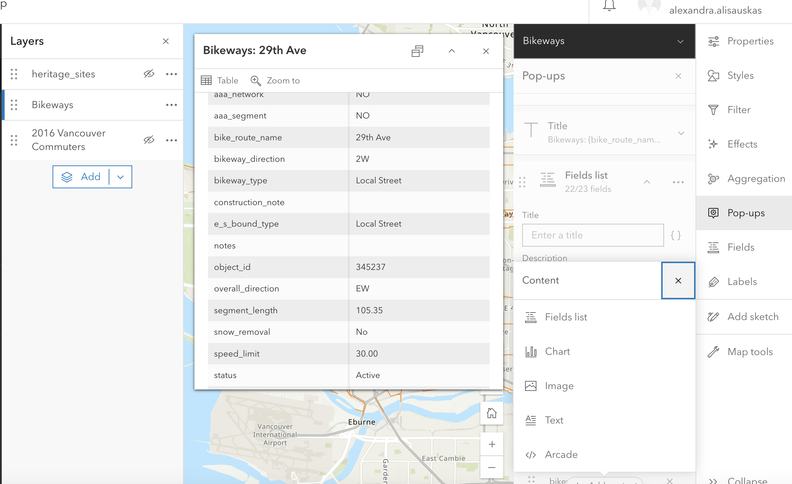
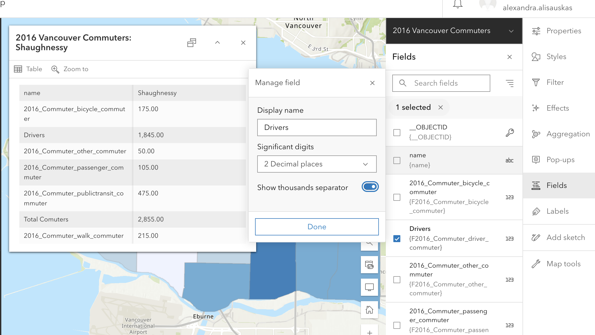
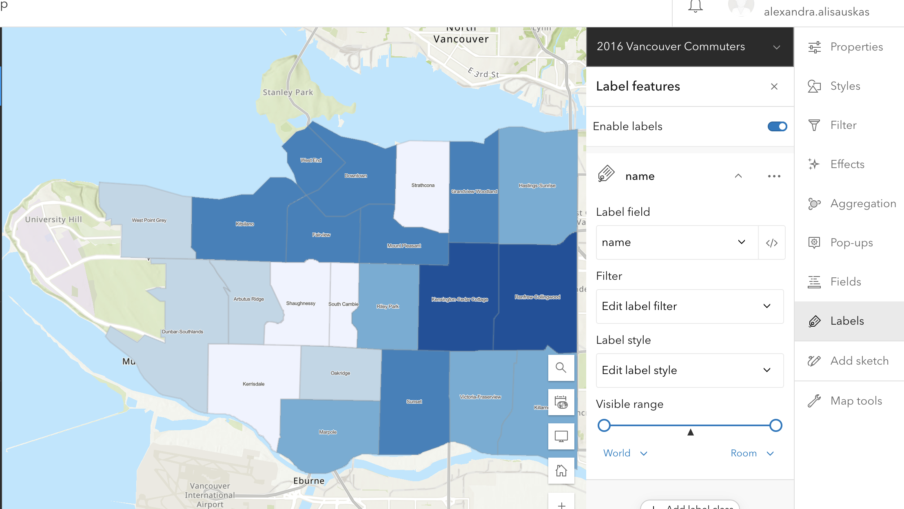

# Other Visualization Tools

## Filter
Use the filter feature to create a condition and determine what shows up on your map. This feature is useful if you have data that varies in type/category or date. You can also filter to only include features in a certain neighbourhood.

If you want to create a Swipe on your Storymap, the Filter function can be very useful to single out data and create the individual maps that make up the Swipe. Once you’ve filtered the data you want to show, make sure to “Save as” your map. In the example below I have filtered heritage sites in the local area of Kitsilano.

To Try
{: .label .label-purple }
On the `heritage_sites` layer, try filtering to include only archeological sites
On the `Bikeways` layer, try filtering to include only bikeways created in the 1990s

 

## Aggregation
You can enable aggregation on your map.

**Binning** aggregates data to predefined cells, representing point, line, or polygon data as a gridded polygon layer. The bins show point, line, or polygon density in geographic space instead of screen space.

**Clustering** aggregates points into clusters and displays them as one symbol. Clusters use proportionally sized symbols and change dynamically with the map scale. Clustering only works for point features.

Spatial aggregation is one method for visualizing high-density data. Read more about best practices for [visualizing high-density data](https://doc.arcgis.com/en/arcgis-online/reference/best-practices-high-density-data.htm).

 

## Pop Ups
Pop-ups can bring focus to the attributes associated with each layer in the map, such as hiking trails, land use types, or unemployment rates. They can contain attachments, images, charts, and text, and they can link to external web pages.

The Pop Ups tool lets you configure which attributes are displayed and how. You can edit how your pop up s titled, and determine which fields to include. You can also add content, like images, charts, or text.

 

## Fields
The fields feature lets you edit field elements for your geographic attributes. In the free account, you can rename fields, and select decimal points.

 

## Labels
The Label feature lets you add labels for various elements on your map. Click enable, then select which field you want to serve as a label. In the examplbe below, the neighbourhood name field is being used as a label.

 

## Add Sketch 
You can add add points, or draw lines, shapes, etc. with the Add Sketch function. This can be useful to highlight map features manually. Any sketch elements you add will create a new layer with those elements.

