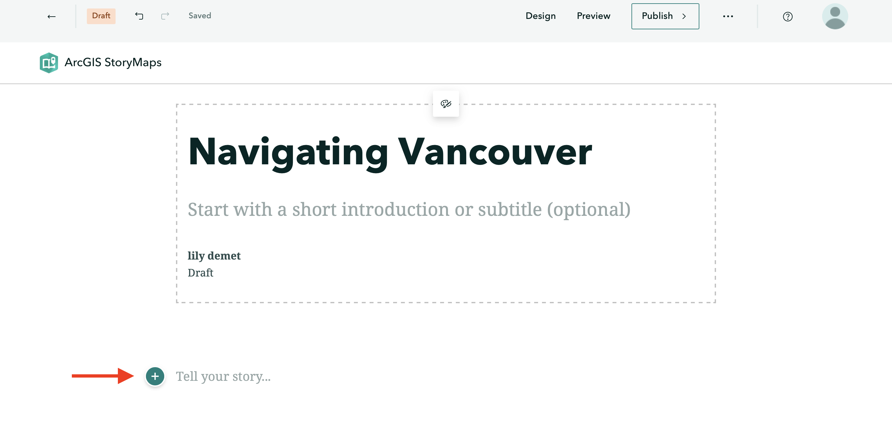

# Adding Content Blocks 
 

A StoryMap is essentially a one-page website made by adding blocks of various content one after another. These blocks are called **content blocks**, and can be added by simply clicking the  waiting below your title.  
 

When you click on , you'll see the different kinds of content that can be added. Notice, however, some options are greyed out when working with a free account. Not to worry — you can still get a lot done with the content blocks available. 

----

## Basic Content Blocks
Basic content blocks include Text, Button, Separator, and Code. 

- **Text** allows you to add and style paragraphs, including hyperlinking text. Once you begin writing, simply highlight the text you want to modify and the styling menu will appear. 

- **Button** allows you to add hyperlinked text styled as a button. Add a word or phrase as appropriate, then click the pencil icon to add a hyperlink. The appearance of button is determined by the StoryMap Theme, and cannot be changed within free account. 

- **Separator** simply adds a plain line to your StoryMap. 

- **Code** allows you to embed a code block formatted as such. Click on the gear icon to indicate what language your code is in. 

- To **delete** any content block, click out of it and then hover over the block until a trashbin icon appears. You can drag and **rearrange** content blocks as you wish. 

## Data Visualization

- **Map** will take you out of StoryMaps to ArcGIS Online mapping platform. Later in this workshop you will be guided through creating a simple web map to embed in your StoryMap.

- **Chart** will create a column, bar, donut, line chart out of manually imputted data. You cannot upload external spreadsheets, however. 

- **Table** creates a simple table which can be populated with text. 

## Media
With a free account, there is the possibility to add **Image** or **Video**. You can either upload or link multimedia. For video in particular, it's recommended to link from an external source, like YouTube, since longer videos will rapidly use up your storage. 

<!-- Swipe - compare two images, for example static maps. remember static maps are made outside and uploaded as image blocks. swipe can also work with maps.  -->

## Immersive 
Immersive content allows you to create guided tours where text and images elaborate locations of significance chosen on an ArcGIS supplied basemap. Remember, you can choose for your entire StoryMap to be formatted in either of these ways. Create a new StoryMap anytime. 

