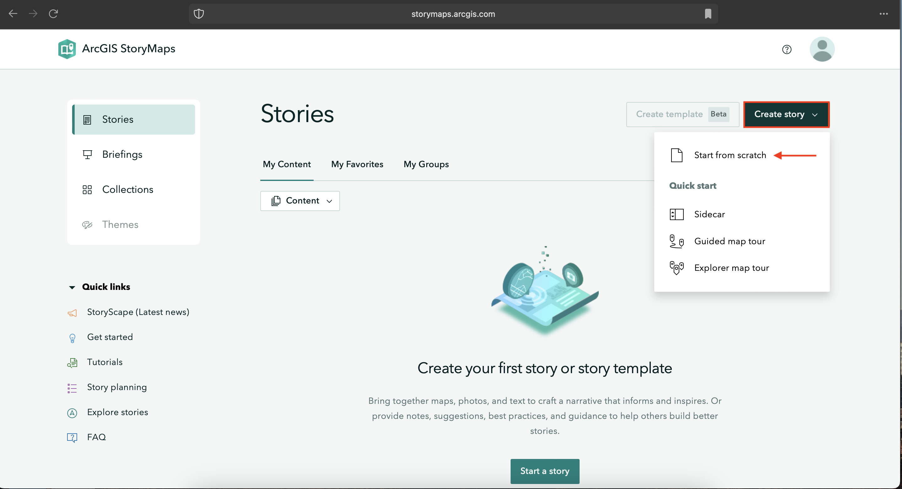
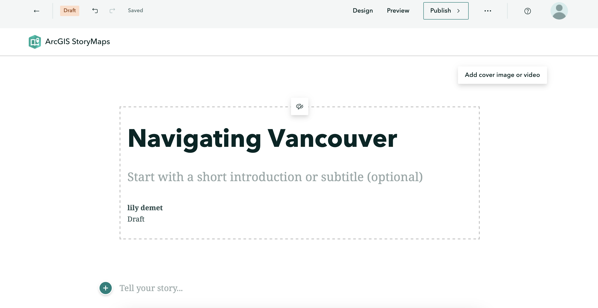

# Create an ArcGIS Online StoryMap
<br>
After creating a free ArcGIS Online Public Account, navigate to [storymaps.arcgis.com/stories](https://storymaps.arcgis.com/stories) and **Sign In**. Click **Create story**. You'll notice there is an option to either Start from scratch or "Quick start" using one of the provided templates. Sidecars and map tours are elements that can be added to any StoryMap, so for the purposes of this workshop, select **Start from scratch**.
    
<br>




Alternatively, you can create a new StoryMap from the ArcGIS Online homepage by going to **Content** (in the top banner) and clicking **Create app**. From here, select **ArcGIS StoryMaps** and you're good to go. 


The StoryMap we will create today is about everyday navigations in Vancouver. The focus is less on creating a cohesive, polished story and more on introducing you to the interface.


Before going further, make sure you've downloaded the [data folder](../storymaps-workshop.zip) and unzipped its contents. This workshop will use data from the Vancouver Open Data portal as well as multimedia collected by your workshop facilitators. Remember, you are encouraged to use your own images from your commutes/everyday navigations in your StoryMap.
{: .note}

<br>

## Exploring the interface 
Go ahead and give your StoryMap the title: `Navigating Vancouver`. You'll notice a little paintbrush and palette icon appears, allowing you to center or justify the header block. Feel free to add a subtitle and descriptive text, as well as your name. You can also add a cover image or video. If you choose to do so, browse and upload a file from the multimedia subfolder of `storymaps-workshop`. (If you haven't moved your own images into the workshop folder, this is a reminder to do so. The purpose of keeping your files together is simply to keep you organized.)

<br>




<br>

- On the top upper left-hand corner of the interface, notice your changes have **saved automatically**. The curved forward and backward arrows allow you to **undo** and **redo** your moves as you go. The straight back arrow will take you back to the StoryMaps homepage. Notice also that you're working in ```Draft``` mode. 

- On the upper right-hand corner of the interface, you'll see options to **Preview** and **Publish** your StoryMap. Preview allows you to look at your StoryMap as if you were an outside visitor to the site, while Publish actually makes your work visible online. You can Publish your StoryMap as many times as you want. Previewing your StoryMap will not change what is Published. 

- Who can see your published work? The three dots (ellipses) beside Publish reveal **more actions**. Here you can delete your story all together, duplicate it (if, for instance, you want to make different versions), and manage the **settings**. 

- To see the **full details** of your StoryMap, go back to the StoryMaps homepage and click the three dots beside your StoryMap's tile. Here you can set things like terms of use, attribution, sharing permissions, description, and more. **Change share access to public, ensuring everyone can see your final map.**


- Lastly, **Design** enables you to choose an out-of-the box **Theme** for your StoryMap. Note: only paid AGOL accounts allow you to create your own Themes. However, there is still a variety to choose from. 

<br>

To Do
{: .label .label-purple}
Before moving on, choose a Theme you like (or keep the default). 
