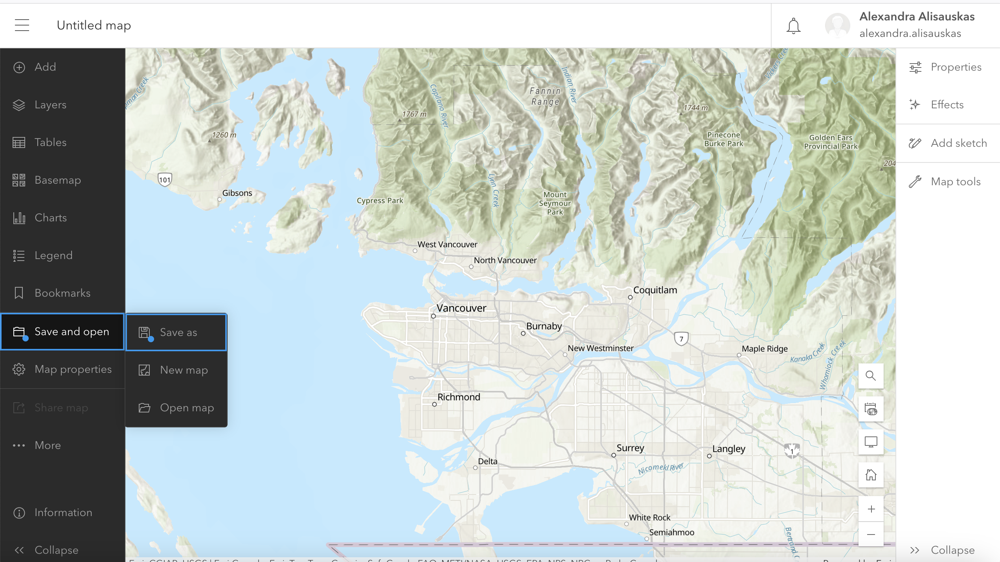

# Create a Web Map with ArcGIS Online 

An ArcGIS web map is an interactive display of geographic information that you can use to tell stories and answer questions. If you want to include any dynamic maps that include layer data in your StoryMap, you will need to create it through ArcGIS Online first. 

The public account and organization account have different user interfaces and functions. The public account does not have access to some functions, including any spatial analysis tools.
{: .note}

----

## Getting Started

To get started creating a webmap, **Sign in** to ArcGIS Online and select **Map** in the top banner. This will take you to a new untitled map project. 

Zoom to the area of interest you want to work on. Select **Save and Open** from the left-hand vertical menu and **Save as** to create a new map anchored at your desired extent. Throughout editing your map, save it to make sure to preserve your visualizations.

Whenever you open a new map in ArcGIS Online, it will open with a default Topographic basemap. To change this, select **Basemap** from the left-hand menu and choose the option that best suits your data and visualization. 