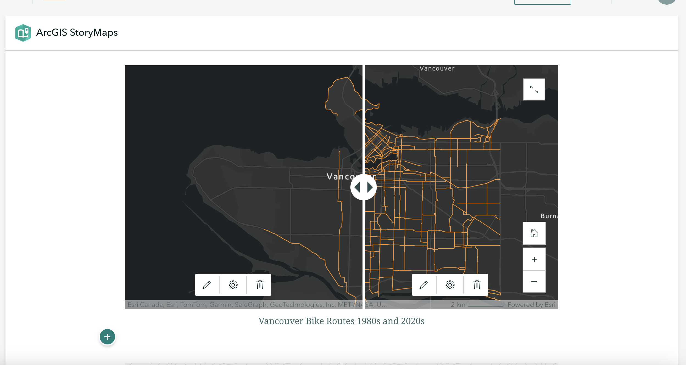

# Finalizing your StoryMap for Publication
Now it's time to add the maps we just created with the online mapping tool to our StoryMap. 

## Add Web Maps to StoryMap
Return to your StoryMap and add a **map** content block. Choose the map you just made.

## Add Swipe
A **Swipe** content block allows you to compare two images, static maps, or even two web maps. Swipe is great to show changes over time.

Each map on the swipe is a separate we bmap. You will have to create a separate web map highlighting the features you want to include. For instance, you will have to create a map for 1980s bike routes and one for 2000s bikeroutes. You can easily do this with the filter option on webmaps.

## Add Credits and Attributions
All the way at the bottom of your StoryMap you can add Credits and Attributions. Here is a great place to note any organization you're working with or cite your research references.  

## Publish 
Although in a real-world scenario you may wait until your project is further along before publishing a first version, let's practice publishing now. (If you don't want to publish your work you can also just preview it to see what it would look like.)

That's it! Now you know how ArcGIS Online StoryMaps works!